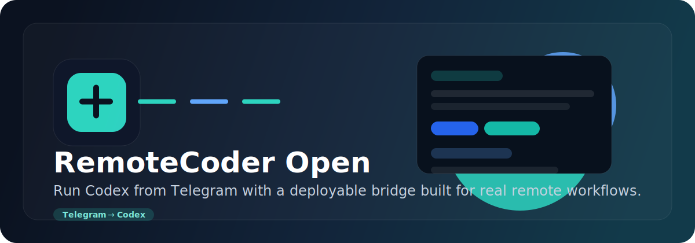

<h1 align="center">
  
  RemoteCoder Open
</h1>

<p align="center">
  <strong>Operate Codex from Telegram through a small FastAPI bridge with workspace controls and session continuity.</strong>
</p>

<p align="center">
  <a href="https://github.com/QtacierP/RemoteCoder-open/stargazers"></a>
  <a href="./LICENSE"></a>
  <a href="https://www.python.org/"></a>
  <a href="https://fastapi.tiangolo.com/"></a>
</p>

<p align="center">
  
</p>

<p align="center">
  
</p>

This repository contains the public application code for a Telegram-to-Codex bridge. It accepts Telegram messages, maps each chat to a Codex session, returns responses back to Telegram, and stores lightweight session state locally.

The public branch intentionally excludes machine-specific deployment scripts, runtime data, logs, chat history, and private environment files.

## Features

- Telegram bot integration with polling or webhook mode
- Per-chat Codex session mapping
- Workspace allowlist protection
- Shared proxy support for both Codex and Telegram requests
- SQLite-backed session and audit persistence
- Health and session inspection endpoints

## Architecture

```text
Telegram User
  -> Telegram Bot API
  -> FastAPI bridge
     -> Telegram adapter
     -> Session service
     -> Codex backend
     -> Workspace guard
     -> Audit log
     -> SQLite
```

## Quick Start

### 1. Requirements

- Linux development environment
- Python 3.12+
- Codex CLI installed and available on `PATH`
- A Telegram bot token from `@BotFather`

### 2. Clone and install

```bash
git clone https://github.com/QtacierP/RemoteCoder-open.git
cd RemoteCoder-open
python3 -m venv .venv
source .venv/bin/activate
pip install -r requirements.txt
cp .env.example .env
```

### 3. Configure `.env`

At minimum, set:

```env
TELEGRAM_BOT_TOKEN=your_bot_token
DEFAULT_WORKSPACE=/absolute/path/to/your/project
ALLOWED_WORKSPACES=
```

Notes:

- If `ALLOWED_WORKSPACES` is empty, only `DEFAULT_WORKSPACE` is allowed.
- Use absolute paths for workspaces.
- Do not commit your real `.env`.

### 4. Run locally

```bash
source .venv/bin/activate
uvicorn app.main:app --host 0.0.0.0 --port 8000 --reload
```

Check health:

```bash
curl http://127.0.0.1:8000/health
```

Expected response:

```json
{"status":"ok","telegram_mode":"polling"}
```

## Telegram Setup

1. Open Telegram and talk to `@BotFather`.
2. Create a new bot.
3. Copy the bot token into `.env` as `TELEGRAM_BOT_TOKEN`.
4. Start the server.
5. Send `/help` to your bot.

## Important Environment Variables

See [.env.example](./.env.example) for the full list.

Common ones:

- `TELEGRAM_BOT_TOKEN`
- `TELEGRAM_MODE=polling|webhook`
- `TELEGRAM_WEBHOOK_URL`
- `APP_HOST`
- `APP_PORT`
- `DEFAULT_CODEX_MODE=codex_cli_session|codex_sdk`
- `DEFAULT_WORKSPACE`
- `ALLOWED_WORKSPACES`
- `CODEX_BIN`
- `CODEX_CLI_ARGS`
- `CODEX_MESSAGE_TIMEOUT_SECONDS`
- `SHARED_PROXY_URL`
- `SHARED_PROXY_PORT`
- `SHARED_PROXY_SCHEME`

## Running On A Server

Use your own process manager or service wrapper for deployment. This public repository intentionally does not include machine-specific startup scripts or service templates.

Minimal example:

```bash
source .venv/bin/activate
uvicorn app.main:app --host 0.0.0.0 --port 8000
```

## Example Telegram Commands

```text
/help
/new
/reset
/status
/workspace
/pwd
/mode
/debug
/debug verbose
```

## API Endpoints

- `GET /health`
- `GET /sessions`
- `GET /sessions/{session_id}`
- `POST /sessions/{session_id}/reset`
- `GET /chats/{chat_id}`
- `POST /telegram/webhook`

## Project Structure

```text
app/
  adapters/
  api/
  codex/
  services/
  config.py
  db.py
  logging.py
  main.py
  schemas.py
tests/
.env.example
requirements.txt
```

## Security Notes

- Never commit `.env`, logs, chat histories, SQLite databases, or machine-specific deployment scripts.
- Restrict `DEFAULT_WORKSPACE` and `ALLOWED_WORKSPACES` carefully.
- Treat Telegram chat access as operational access to your Codex workflow.

## Troubleshooting

### Bot does not reply

- Verify `TELEGRAM_BOT_TOKEN`
- Check `curl http://127.0.0.1:8000/health`
- Confirm outbound access to `api.telegram.org`

### Codex calls fail

- Verify `CODEX_BIN`
- Keep `CODEX_CLI_ARGS` compatible with your Codex CLI version
- Check proxy settings if your network requires them

### Workspace errors

- Make sure `DEFAULT_WORKSPACE` exists
- Make sure the target path is allowed by `ALLOWED_WORKSPACES`

## License

Released under the MIT License. See [LICENSE](./LICENSE).
