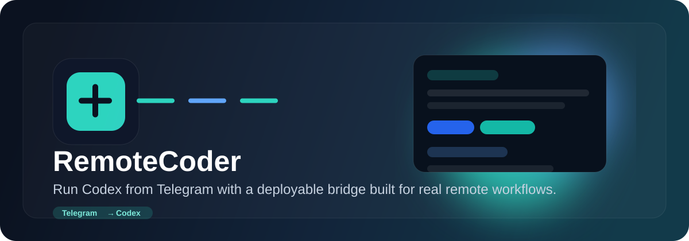
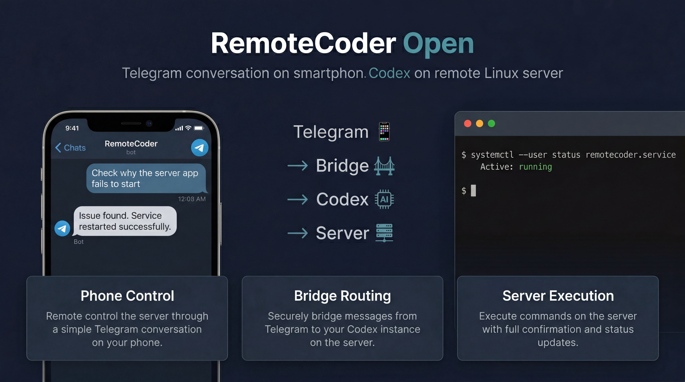

<h1 align="center">
  
  RemoteCoder
</h1>

<p align="center">
  <strong>Use Codex from Telegram with session continuity, workspace controls, backend switching, and long-running task support.</strong>
</p>

<p align="center">
  <a href="https://www.python.org/"></a>
  <a href="https://fastapi.tiangolo.com/"></a>
  <a href="./LICENSE"></a>
</p>

<p align="center">
  
</p>

<p align="center">
  
</p>

RemoteCoder is a small FastAPI bridge between Telegram and a local coding backend. Each Telegram chat gets its own session, workspace, shell state, and command surface. The project is designed for real remote coding workflows rather than simple chat completions.

## What It Does

- Receives Telegram bot messages and routes them to a backend session
- Keeps per-chat session state, workspace selection, and history
- Supports backend switching without losing the current workspace
- Runs direct shell commands and long-running background jobs
- Persists lightweight state in SQLite
- Exposes health and session inspection endpoints

## Core Concepts

### 1. Chat session

Each Telegram chat maps to a current coder session. A session tracks:

- backend mode
- current workspace
- session label
- timeout and trace state
- provider selection
- transcript history

### 2. Backend mode

The app supports multiple backend modes internally. The main user-facing switch is:

- `codex` -> `codex_cli_session`
- `claude_code` -> `claude_code_cli_session`

You switch with:

```text
/backend codex
/backend claude_code
```

### 3. Workspace boundary

Every session runs inside an allowed workspace. The workspace guard uses:

- `DEFAULT_WORKSPACE`
- `ALLOWED_WORKSPACES`

If `ALLOWED_WORKSPACES` is empty, only `DEFAULT_WORKSPACE` is allowed.

### 4. Shell state

In addition to the coding backend, each chat also has a persistent shell context for direct commands, conda environment selection, and background tasks.

## Quick Start

### Requirements

- Linux machine
- Python 3.12+
- Codex CLI installed and on `PATH`
- Telegram bot token from `@BotFather`

### Install

```bash
git clone https://github.com/<your-account>/RemoteCoder-open.git
cd RemoteCoder-open
python3 -m venv .venv
source .venv/bin/activate
pip install -r requirements.txt
cp .env.example .env
```

### Minimal `.env`

```env
TELEGRAM_BOT_TOKEN=your_bot_token
APP_HOST=0.0.0.0
APP_PORT=8001
DEFAULT_WORKSPACE=/absolute/path/to/your/project
ALLOWED_WORKSPACES=
CODEX_BIN=codex
CODEX_CLI_ARGS=-a never --sandbox workspace-write
```

### Run

```bash
source .venv/bin/activate
uvicorn app.main:app --host 0.0.0.0 --port 8001
```

Health check:

```bash
curl http://127.0.0.1:8001/health
```

Expected shape:

```json
{"status":"ok","telegram_mode":"polling"}
```

## Configuration

The public example file is [.env.example](./.env.example).

Important variables:

- `TELEGRAM_BOT_TOKEN`: Telegram bot token
- `TELEGRAM_MODE`: `polling` or `webhook`
- `TELEGRAM_WEBHOOK_URL`: required for webhook mode
- `APP_HOST`, `APP_PORT`: FastAPI bind host and port
- `DATABASE_PATH`: SQLite file path
- `LOG_DIR`: runtime log directory
- `CONVERSATION_HISTORY_DIR`: transcript directory
- `DEFAULT_CODEX_MODE`: default backend mode at session creation
- `DEFAULT_WORKSPACE`: fallback workspace
- `ALLOWED_WORKSPACES`: comma-separated allowed roots
- `CODEX_BIN`: Codex executable
- `CODEX_CLI_ARGS`: extra Codex CLI arguments
- `CODEX_MESSAGE_TIMEOUT_SECONDS`: backend reply timeout
- `SHARED_PROXY_URL`: explicit proxy URL
- `SHARED_PROXY_PORT`: convenience local proxy port
- `SHARED_PROXY_SCHEME`: usually `socks5h`

Proxy behavior:

- If `SHARED_PROXY_URL` is set, it is used directly.
- If `SHARED_PROXY_PORT > 0`, the app builds `<scheme>://127.0.0.1:<port>`.
- The proxy can be toggled at runtime for each backend with Telegram commands.

## Telegram Setup

1. Create a bot with `@BotFather`
2. Put the token into `.env`
3. Start the FastAPI app
4. Send `/help` to the bot

## Command Guide

The bot exposes an operational command surface. Commands are grouped below by purpose.

### Session Commands

```text
/new [label]
/reset
/status [verbose]
/workspace
/workspace <path>
/workspace <path> :: <label>
/workspaces
/session list
/session <session_id|tag>
/session label <tag>
/session clear
/session delete <session_id|tag>
/pwd
/mode
/timeout
/timeout <seconds|-1>
/context_handoff
/context_handoff <off|light>
```

What they are for:

- `/new [label]`: create a fresh session for the current chat
- `/reset`: reset the current session
- `/status [verbose]`: show current backend, workspace, transcript, and shell state
- `/workspace <path>`: switch the current workspace
- `/session list`: show this chat's sessions
- `/session <session_id|tag>`: switch to another session
- `/session label <tag>`: rename the current session
- `/session clear`: clear the chat's session list and create a new one
- `/session delete <id|tag>`: delete a non-current session
- `/timeout <seconds|-1>`: override backend reply timeout, `-1` means unlimited
- `/context_handoff light`: carry a compact summary when switching backend/provider

### Backend Switching And Provider Commands

```text
/backend <codex|claude_code>
/codex api add <label> :: <model> :: <base_url> :: <api_key>
/codex api delete <label>
/codex api list
/codex api switch <label|default>
/codex proxy [on|off]
/claude api add <label> :: <model> :: <base_url> :: <api_key>
/claude api delete <label>
/claude api list
/claude api switch <label|default>
/claude proxy [on|off]
/trace [n]
/trace raw [n]
/trace error [n]
/cancel
/resend [n]
```

Common backend workflows:

Switch the current chat from Codex to Claude-style backend:

```text
/backend claude_code
```

Add and switch a Codex-compatible provider:

```text
/codex api add relay :: gpt-5.4 :: https://provider.example.invalid/v1 :: <api_key>
/codex api switch relay
```

Add and switch a Claude-style provider:

```text
/claude api add provider-a :: model-v1 :: https://provider.example.invalid/v1 :: <api_key>
/claude api switch provider-a
```

Turn backend proxying on or off:

```text
/codex proxy on
/claude proxy off
```

Inspect or interrupt a stuck reply:

```text
/trace
/trace raw 50
/trace error 50
/cancel
```

### Shell And Task Commands

```text
/cmd <command>
/cmd top
/cmd jobs
/cmd status [lines]
/cmd reset
/cmd bg <command>
/cmd bg <command> :: <label>
/cmd bg all
/cmd bg delete <job_id>
/cmd bg clear
/cmd stop <job_id>
/cmd stop all
/log [job_id] [lines]
/watch [job_id] [lines]
/watch [job_id] [lines] :: kw1,kw2
/conda
/conda <env>
/conda envs
/conda off
/gpu
```

How task running works:

- `/cmd <command>` runs in the persistent per-chat shell
- `/cmd bg <command>` starts a background job and stores its log
- `/cmd jobs` lists jobs for the current chat
- `/log` tails raw job output
- `/watch` filters useful progress lines such as loss, epoch, bleu, rouge
- `/cmd stop <job_id>` stops a running job
- `/cmd bg clear` deletes all stored background job records for the chat

Example training workflow:

```text
/workspace /srv/project
/conda trainer
/cmd bg python train.py --config configs/base.yaml :: train-base
/cmd jobs
/watch 1 80 :: epoch,loss,bleu
/log 1 120
/cmd stop 1
```

Example utility workflow:

```text
/cmd git status
/cmd pytest tests/test_shell_watch.py
/cmd bg python scripts/build_index.py :: indexer
/cmd status
```

### Git Commands

```text
/git status
/git diff [path]
/git log [n]
/git branch
/git show [ref]
/git add <path>
/git commit <message>
/git push [remote] [branch]
```

These commands operate inside the current workspace, not an arbitrary path outside the workspace guard.

### File Commands

```text
/ls [path]
/tree [path] [depth]
/read <path> [start_line] [lines]
/tail <path> [lines]
/find <pattern> [path]
/grep <pattern> [path]
/show <path>
/download <path>
```

Use these to inspect files, tail logs, or send artifacts back through Telegram.

### Diagnostics And Service Commands

```text
/debug
/debug verbose
/restart service
/help
```

- `/debug`: short Telegram connectivity and runtime diagnostics
- `/debug verbose`: more detailed diagnostics
- `/restart service`: schedule a local user-service restart after a short delay

## Typical Workflows

### 1. Start a fresh coding session

```text
/new feature-x
/workspace /srv/repo
/backend codex
/cmd git status
```

### 2. Switch backend but keep context

```text
/context_handoff light
/backend claude_code
/status
```

### 3. Run a long job and monitor progress

```text
/cmd bg python train.py :: training
/watch 1 100 :: epoch,loss,val_accuracy
/log 1 200
```

### 4. Move back to the default provider

```text
/codex api switch default
/claude api switch default
```

## HTTP API

Primary endpoints:

- `GET /health`
- `GET /sessions`
- `GET /sessions/{session_id}`
- `POST /sessions/{session_id}/reset`
- `GET /chats/{chat_id}`
- `POST /telegram/webhook`

These endpoints are mainly for inspection and Telegram integration, not for replacing the Telegram command surface.

## Project Layout

```text
app/
  adapters/
  api/
  codex/
  services/
  config.py
  db.py
  logging.py
  main.py
  schemas.py
assets/
tests/
.env.example
requirements.txt
```

## Security Notes

- Do not commit `.env`, database files, logs, or transcript history
- Keep `DEFAULT_WORKSPACE` and `ALLOWED_WORKSPACES` narrow
- Treat Telegram access as shell-and-coder access
- Prefer a dedicated Linux user for deployment
- Review provider endpoints and API keys before adding them through chat commands

## Troubleshooting

### Bot does not reply

- Check `TELEGRAM_BOT_TOKEN`
- Check `curl http://127.0.0.1:8001/health`
- Verify outbound access to `api.telegram.org`
- Use `/debug` and `/debug verbose`

### Backend replies fail or hang

- Check `CODEX_BIN`
- Check `CODEX_CLI_ARGS`
- Use `/trace`, `/trace raw`, `/trace error`
- Use `/cancel` to stop the current reply
- Try `/timeout 300` or `/timeout -1` for long tasks

### Workspace switching fails

- Verify the target path exists
- Verify the path is inside `ALLOWED_WORKSPACES`
- Use `/workspaces` to inspect allowed roots

### Background jobs are hard to follow

- Use `/cmd jobs` to find the job id
- Use `/log <job_id> 200` for raw tail
- Use `/watch <job_id> 100 :: epoch,loss` for filtered progress

## License

Released under the MIT License. See [LICENSE](./LICENSE).
